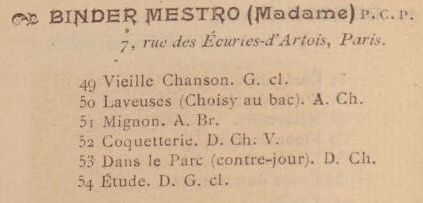

# Artl@s Pipeline

La pipeline utilisée pour le traitement des catalogues de notre corpus a été conçue par Juliette Janès pour le projet Artl@s, avec pour objectif le traitement semi-automatisé de catalogues d'exposition du XIXe au XXe siècle afin de permettre leur versement sur la base de données BasArt. A la suite du travail de [Caroline Corbières](https://github.com/carolinecorbieres/Memoire\_TNAH), la chaîne de traitement a été repensée par [Juliette Janès](https://github.com/Juliettejns/Memoire\_TNAH) dans la perspective de la rendre la plus OpenSource possible. Nous recommandons vivement la lecture de leurs travaux afin mieux saisir les enjeux scientifiques et techniques qui ont guidés leurs interventions respectives.&#x20;

Juliette Janès a ainsi proposé un prototype de programme écrit en Python et pouvant être utilisé en ligne de commande directement dans le terminal d'un ordinateur. Le programme permet l'extraction des données textuelles des entrées de catalogue à partir des fichiers ALTO généré par FoNDUE pour chaque page des catalogues traités. Ces entrées sont extraites de manière structurée dans un fichier XML TEI, utilisé comme format pivot dans la chaîne de traitement car particulièrement adapté au traitement de documents semi-structurés tels que les catalogues. L'ensemble des fichiers ALTO (un fichier par page de catalogue) sont fournis en entrée au programme et celui-ci en extrait les données, permettant d'obtenir en sortie du programme un unique fichier TEI réunissant l'ensemble des entrées d'un catalogue. L'[ODD](https://github.com/carolinecorbieres/ArtlasCatalogues/tree/master/5\_ImproveGROBIDoutput/ODD) permettant la validation de l'encodage adopté pour les catalogues, notamment l'usage de la balise `<entry>` non conforme aux recommandations P5 de la TEI, a été élaboré par Caroline Corbières.&#x20;

**Exemple d'une entrée de catalogue :**&#x20;



**Exemple de l'entrée de catalogue segmentée en ALTO fournie au programme :**&#x20;

```
<TextBlock HPOS="121"
                   VPOS="97"
                   WIDTH="433"
                   HEIGHT="202"
                   ID="eSc_textblock_1725f4e2"
                   TAGREFS="BT299">
          <Shape><Polygon POINTS="121 97 121 299 554 299 554 97"/></Shape>
          
          
          <TextLine ID="eSc_line_89da1865"
                    TAGREFS="LT108"
                    BASELINE="136 119 544 113" 
                    HPOS="134"
                    VPOS="84"
                    WIDTH="410"
                    HEIGHT="46">
            <Shape><Polygon POINTS="136 119 134 106 202 104 226 89 227 89 227 89 228 89 228 89 228 89 229 89 254 89 260 85 260 85 261 85 261 85 261 85 262 85 262 85 263 85 263 85 263 85 264 85 279 89 309 84 309 84 309 84 310 84 310 84 311 84 330 89 378 86 379 86 379 86 419 92 427 87 428 87 428 87 429 87 429 87 429 87 430 87 430 87 431 87 431 87 431 87 432 87 432 87 446 99 448 100 449 99 468 87 469 87 469 87 469 87 470 87 470 87 471 87 471 87 542 97 544 113 542 127 495 123 457 128 456 128 456 128 455 128 455 128 455 128 455 128 455 128 455 128 441 123 421 128 421 128 421 128 420 128 420 128 420 128 419 128 419 128 409 123 354 128 354 128 354 128 354 128 331 123 326 128 326 128 325 128 325 128 325 128 324 128 324 128 324 129 283 129 282 128 282 128 252 123 136 130"/></Shape>
	    <String CONTENT="☙ BINDER MESTRO (Madame) P. C. P."
                    HPOS="134"
                    VPOS="84"
                    WIDTH="410"
                    HEIGHT="46"></String>
          </TextLine>

          
          
          <TextLine ID="eSc_line_0c88e107"
                    TAGREFS="LT108"
                    BASELINE="245 143 516 138" 
                    HPOS="243"
                    VPOS="119"
                    WIDTH="273"
                    HEIGHT="36">
            <Shape><Polygon POINTS="245 143 243 126 288 119 288 119 289 119 514 120 516 138 516 149 492 151 492 151 491 151 491 151 490 151 490 151 490 151 489 151 489 151 488 150 484 146 477 150 471 152 471 152 470 152 470 152 470 153 434 153 433 152 419 151 395 148 387 151 384 152 384 152 383 152 383 152 383 152 382 152 382 152 375 151 349 148 342 152 338 154 338 154 338 154 337 154 337 154 337 154 337 154 337 154 336 154 336 154 331 152 323 149 311 149 307 152 305 154 305 155 305 155 304 155 304 155 304 155 303 155 303 155 303 155 303 155 303 155 302 155 302 155 297 153 290 150 245 153"/></Shape>
	    <String CONTENT="7, rue des Écuries-d&#39;Artois, Paris."
                    HPOS="243"
                    VPOS="119"
                    WIDTH="273"
                    HEIGHT="36"></String>
          </TextLine>

          
          
          <TextLine ID="eSc_line_0b73353f"
                    TAGREFS="LT108"
                    BASELINE="203 183 421 178" 
                    HPOS="201"
                    VPOS="154"
                    WIDTH="220"
                    HEIGHT="33">
            <Shape><Polygon POINTS="203 183 201 157 233 156 234 156 234 156 234 156 235 156 235 156 240 157 251 162 258 158 262 156 263 156 263 156 264 156 264 156 264 156 264 156 264 156 265 156 275 158 283 160 286 158 295 154 295 154 295 154 296 154 296 154 297 154 297 154 297 154 298 154 312 158 320 155 320 155 321 155 321 155 321 155 322 155 322 155 323 155 323 155 323 155 324 155 324 155 324 156 328 159 330 162 366 162 368 160 371 157 371 156 371 156 371 156 371 156 371 156 372 156 372 156 373 156 373 156 411 161 421 178 420 185 203 187"/></Shape>
	    <String CONTENT="49 Vieille Chanson. G. cl."
                    HPOS="201"
                    VPOS="154"
                    WIDTH="220"
                    HEIGHT="33"></String>
          </TextLine>

          
          
          <TextLine ID="eSc_line_9e47d2a0"
                    TAGREFS="LT108"
                    BASELINE="202 202 494 199" 
                    HPOS="200"
                    VPOS="180"
                    WIDTH="294"
                    HEIGHT="32">
            <Shape><Polygon POINTS="202 202 200 183 492 180 494 199 494 206 307 206 307 206 303 210 303 211 303 211 302 211 302 211 302 211 301 211 301 211 301 211 300 211 300 211 299 211 284 207 254 212 254 212 253 212 253 212 253 212 253 212 253 212 253 212 252 212 245 207 202 207"/></Shape>
	    <String CONTENT="50 Laveuses (Choisy au bac). A. Ch."
                    HPOS="200"
                    VPOS="180"
                    WIDTH="294"
                    HEIGHT="32"></String>
          </TextLine>

          
          
          <TextLine ID="eSc_line_2246949a"
                    TAGREFS="LT108"
                    BASELINE="202 223 351 219" 
                    HPOS="201"
                    VPOS="203"
                    WIDTH="150"
                    HEIGHT="24">
            <Shape><Polygon POINTS="202 223 201 206 348 203 351 219 351 224 202 227"/></Shape>
	    <String CONTENT="51 Mignon. A. Br."
                    HPOS="201"
                    VPOS="203"
                    WIDTH="150"
                    HEIGHT="24"></String>
          </TextLine>

          
          
          <TextLine ID="eSc_line_c6c6f5df"
                    TAGREFS="LT108"
                    BASELINE="202 241 410 238" 
                    HPOS="200"
                    VPOS="220"
                    WIDTH="210"
                    HEIGHT="26">
            <Shape><Polygon POINTS="202 241 200 223 351 225 407 220 410 238 410 245 202 246"/></Shape>
	    <String CONTENT="52 Coquetterie. D. Ch. V."
                    HPOS="200"
                    VPOS="220"
                    WIDTH="210"
                    HEIGHT="26"></String>
          </TextLine>

          
          
          <TextLine ID="eSc_line_bbe28de5"
                    TAGREFS="LT108"
                    BASELINE="202 261 506 257" 
                    HPOS="200"
                    VPOS="234"
                    WIDTH="306"
                    HEIGHT="38">
            <Shape><Polygon POINTS="202 261 200 246 230 239 230 239 230 239 231 239 231 239 267 243 273 244 277 243 297 238 298 238 298 238 298 238 298 238 323 241 333 243 372 240 419 237 420 237 420 237 420 237 421 237 421 237 421 237 421 237 423 239 427 241 435 239 448 234 449 234 449 234 449 234 449 234 504 237 506 257 505 268 293 266 256 266 255 267 247 272 246 272 246 272 245 272 245 272 245 272 244 272 244 272 243 272 243 272 243 272 242 272 242 272 242 271 237 267 237 267 202 267"/></Shape>
	    <String CONTENT="53 Dans le Parc (contre-jour). D. Ch."
                    HPOS="200"
                    VPOS="234"
                    WIDTH="306"
                    HEIGHT="38"></String>
          </TextLine>

          
          
          <TextLine ID="eSc_line_50e08444"
                    TAGREFS="LT108"
                    BASELINE="202 281 362 279" 
                    HPOS="201"
                    VPOS="262"
                    WIDTH="161"
                    HEIGHT="32">
            <Shape><Polygon POINTS="202 281 201 262 360 264 362 279 362 290 202 294"/></Shape>
	    <String CONTENT="54 Étude. D. G. cl."
                    HPOS="201"
                    VPOS="262"
                    WIDTH="161"
                    HEIGHT="32"></String>
          </TextLine>

          
        </TextBlock>
```

**Exemple de l'entrée de catalogue structurée en TEI en sortie de programme :**&#x20;

```
        <entry n="22" xml:id="PCP_1897_TEI_e22" source="https://cdm16028.contentdm.oclc.org/iiif/2/p15324coll19:4567/121,97,433,202/full/0/default.jpg">
          <desc>
            <name>BINDER MESTRO (Madame)</name>
            <trait>
              <p>P. C. P. 7, rue des Écuries-d'Artois, Paris.</p>
            </trait>
          </desc>
          <item n="49" xml:id="PCP_1897_TEI_e22_i49">
            <num>49</num>
            <title>Vieille Chanson.</title><desc>G. cl.</desc>
          </item>
          <item n="50" xml:id="PCP_1897_TEI_e22_i50">
            <num>50</num>
            <title>Laveuses (Choisy au bac).</title><desc>A. Ch.</desc>
          </item>
          <item n="51" xml:id="PCP_1897_TEI_e22_i51">
            <num>51</num>
            <title>Mignon.</title><desc>A. Br.</desc>
          </item>
          <item n="52" xml:id="PCP_1897_TEI_e22_i52">
            <num>52</num>
            <title>Coquetterie.</title><desc>D. Ch. V.</desc>
          </item>
          <item n="53" xml:id="PCP_1897_TEI_e22_i53">
            <num>53</num>
            <title>Dans le Parc (contre-jour).</title><desc>D. Ch.</desc>
          </item>
          <item n="54" xml:id="PCP_1897_TEI_e22_i54">
            <num>54</num>
            <title>Étude.</title><desc>D. G. cl.</desc>
          </item>
        </entry>
```

A travers cet exemple on voit que l'entrée telle qu'elle est encodée dans le fichier ALTO est contenue dans une balise `<TextBlock>`, c'est ici le `TAGREFS="BT299"` qui correspond dans ce fichier à l'annotation SegmOnto `CustomZone:entry`, qui permettra au script python de répérer le début et la fin de l'entrée. En revanche, les différentes lignes de texte contenues dans le fichier ALTO sont indifférenciées au sein d'un `<TextBlock>`.&#x20;

C'est l'usage d'expressions régulières dans le programme Python qui permet d'identifier le nom de l'exposant, les informations biographiques le concernant, les différents items présentés par l'exposant ainsi que leur éventuelle description, et ainsi de répartir toutes ces données dans les balises TEI correspondantes. Malgré une majorité de traits communs, chaque catalogue peut présenter des variations dans la mise en page et les éléments typographiques utilisés pour structurer les différentes informations d'une entrée. Il faut donc prendre en compte ces variations et modifier les expressions régulières du programme en conséquence. Un certain nombre de cas de figure, les plus récurents, ont été anticipés et intégrés au script Python dédié. Nous en avons ajouté quelques unes pour s'adapter à nos catalogues.

Une partie de notre corpus a été traitée grâce au[ prototype de programme](https://github.com/Juliettejns/Memoire\_TNAH) élaboré par Juliette Janès. Cependant, bien que déjà très performant, ce prototype appelait à être amélioré. Il y avait notamment beaucoup de corrections à effectuer dans le fichier TEI obtenu en sortie. C'est Esteban Sánchez Oeconomo qui a ainsi pris en main cette tâche, afin de faciliter l'utilisation du programme ([version mise à jour ici](https://github.com/IMAGO-Catalogues-Jjanes/extractionCatalogs)). Nous avons ainsi pu profiter des améliorations apportées au programme et traiter le reste de notre corpus de catalogues de manière encore plus efficace.&#x20;

Après avoir obtenu le fichier TEI en sortie du programme, une [feuille de transformation XSLT](https://github.com/carolinecorbieres/ArtlasCatalogues/tree/master/6\_TEItoCSV) permet de transposer ces données structurées dans un fichier CSV, afin d'obtenir des données sous la forme d'un tableur dont les différentes colonnes sont adaptées au versement dans la base BaseArt du projet Artl@s. Néanmoins le nombre de colonnes remplies dans le fichier CSV ainsi généré est assez limité, car lié aux différentes balises utilisées pour les entrées dans le fichier TEI. Ces fichiers CSV doivent donc à être corrigés, afin de répartir les informations de manière plus pertinente, mais aussi enrichis afin de compléter les informations déjà renseignées et procéder à une analyse plus approfondie.&#x20;

L'ensemble des fichiers TEI et CSV ainsi obtenus à partir de notre corpus de catalogues sont disponibles et librement réutilisable (sous licence [CC-BY](https://github.com/PictoCatalogs/Corpus)) sur le [dépôt GitHub](https://github.com/PictoCatalogs/Corpus) du projet PictoCatalogs.
