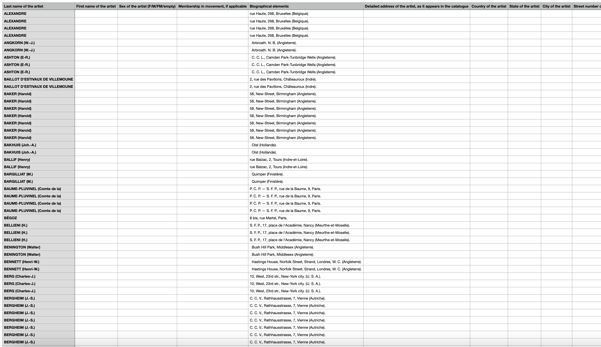
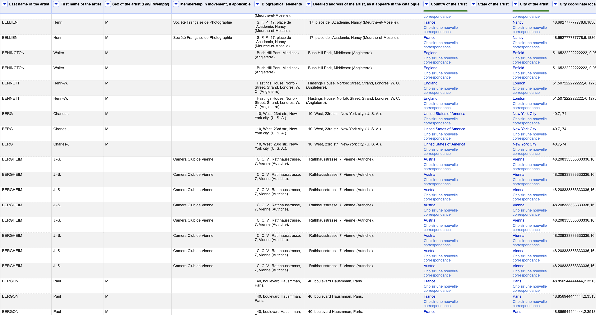

# Data cleanup

### OpenRefine

Une étape fondamentale après l'obtention du fichier CSV est celle du nettoyage et de l'enrichissement du fichier (voir ce [tutoriel](https://programminghistorian.org/fr/lecons/nettoyer-ses-donnees-avec-openrefine)). En effet, à partir du fichier TEI transformé en CSV, seules quelques colonnes sont remplies dans le tableur conçu pour les catalogues d'exposition de la base de données BasArt.  &#x20;

Il fallait donc déconcatener certaines informations contenues dans un même champ (noms, prénoms, adresses, ville, pays, sociétés photographiques auxquelles appartiennent les exposants) et les répartir dans les colonnes appropriées. De nombreuses informations issues des catalogues se trouvaient sous la forme d'abbréviations ou de sigles (sociétés photographiques et procédés photographiques employés pour réaliser les épreuves) qu'il fallait retranscrire entièrement pour faciliter leur compréhension. Lorsque les informations concernant les villes et les pays de résidence des exposants étaient absentes, il fallait également les compléter afin de permettre un géoréférencement le plus exhaustif possible. Nous avons également renseigné le sexe des exposants dans la mesure où il était possible de le connaître grâce au prénom et aux mentions de civilités. Lorsque nos recherches ne nous ont pas permis de déduire le sexe de l'exposant, nous ne l'avons pas renseigné. &#x20;

### Géoréférencement

Un des objectifs majeurs de ce travail était de pouvoir réaliser une étude de la répartition des pays, des villes ainsi que des adresses parmi les exposants. Pour y parvenir un travail de géoréférencement était nécessaire, OpenRefine a permis de faciliter grandement cette opération, notamment grâce aux possiblités offertes par le web sémantique. C'est principalement l'outil intégré de réconciliation que nous avons mis à profit, grâce aux données issues de [Wikidata](https://www.wikidata.org/wiki/Wikidata:Main\_Page). Après avoir réparti les pays, villes et adresses dans les colonnes correspondantes nous avons ainsi pu associer ces lieux (chaînes de caractères) avec leur notice sur Wikidata. Grâce à la création d'une nouvelle colonne basée sur ces valeurs réconciliées, nous avons pu automatiquement récupérer l'ensemble des coordonnées géographiques renseignées sur les notices Wikidata.&#x20;

L'usage d'OpenRefine a largement facilité et accéléré le travail de correction et d'enrichissement en permettant d'automatiser une grande partie des opérations en appliquant des modifications sur un lot important de cellules. Par le biais de son système de facettes, cet outil permet aussi, au delà des corrections, de réaliser une première analyse de la distribution des valeurs dans cet ensemble de données.&#x20;

Nous avons également concaténé les tableurs correspondants à chacun des catalogues traités pour obtenir un unique tableur réunissant l'ensemble des données issues des catalogues. Un travail d'homogénéisation a donc été nécessaire (notamment pour l'orthographe des noms) afin de permettre une analyse computationnelle de qualité à partir de ce tableur fusionné.&#x20;

Les fichiers TSV issus des catalogues, enrichis au moyen d'OpenRefine, ainsi que le fichier TSV des catalogues fusionnés sont disponibles et librement réutilisables (sous licence [CC-BY](https://github.com/PictoCatalogs/Corpus)) sur le [dépôt GitHub](https://github.com/PictoCatalogs/Corpus) du projet PictoCatalogs.
