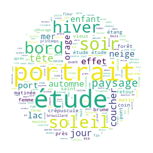

# Data analysis

### Analyses géographiques

Une des priorités de notre étude était de parvenir à étudier le plus précisement possible la répartition géographique des exposants dans le cadre de ces expositions internationales. Parmi les catalogues du corpus, seuls les catalogues d'exposition du Photo-Club de Paris (1894, 1895, 1896, 1897, 1898, 1902, 1904, 1906) ont été traités grâce à la chaîne de traitement Artl@s, permettant d'extraire les informations relatives aux exposants. 5050 oeuvres ont été extraites de ces catalogues et avec elles, la totalité des pays et des villes d'origine de leur exposant, et près de 55% des adresses des photographes ont pu être associées avec leurs coordonnées géographiques.&#x20;

#### Analyses quantitatives

Des visualisation des données réalisées grâce à un logiciel tableur type Excel ou Numbers peuvent déjà fournir de très bons résultats du point de vue des analyses quantitatives. Certaines recherches, telles que celle cherchant à croiser différentes facettes, se réalisent particulièrement rapidement au moyen d'OpenRefine et à partir de notre fichier TSV concaténant toutes les données extraites des différents catalogues.

Au moyen d'Excel, nous avons réaliser un comptage par années des pays et des villes d'où provenaient les auteurs des photographies présentées aux expositions du Photo-Club de Paris.

A partir de ces feuilles de calcul nous avons visualisé ces données grâce à un graphique en aires :&#x20;

#### Cartographies

Par le biais d'un notebook Python (adresse ici), nous avons également procédé à la cartographie de ces données géolocalisées. Nous avons fait le choix d'une cartographie zoomable réalisée grâce à la librairie Python [Folium](http://python-visualization.github.io/folium/modules.html), qui permet de réaliser des cartographie interactives.

La cartographie ci-dessous présente les rues parisiennes ayant été géolocalisées. La taille du repère dépend du nombre d'oeuvres exposées. Seules les rues de la ville de Paris ont été géolocalisée de manière exhaustive, car toutes les rues du corpus traité ne disposaient pas de notices Wikidata permettant de récupérer les coordonnées géographiques automatiquement grâce à OpenRefine.&#x20;

### Analyses iconographiques

Différentes manières s'offrent là encore à nous pour étudier l'iconographie des photographies exposées.

#### Nuage de mots

D'une part, à partir des données textuelles extraites des catalogues d'exposition du Photo-Club de Paris, nous avons pu constater la fréquence de certains mots dans les titres des oeuvres exposées se référant au genre et au sujet de l'image. Grâce à un notebook Python, nous avons réalisé une un nuage de mot pour les termes les plus récurrents dans les titres.&#x20;

#### Tagging

Afin de tagger rapidement l'ensemble des catalogues illustrés du corpus international, nous avons utilisé une autre méthode, celle du _tagging_, au moyen du logiciel open source [Tropy](https://www.tropy.org). Grâce à son interface graphique et ses différents plugins, Tropy permet d'importer et modifier les métadonnées de chaque page numérisée ainsi que d'indexer rapidement l'ensemble du corpus de photographies reproduites et de publicités dans 76 catalogues d'exposition de 1892 à 1914. Le logiciel permet aussi de réaliser un export CSV des images avec les différents mots-clefs choisis. A partir de ce CSV nous avon pu réaliser des analyses quantitatives.&#x20;

**Choix des mots cléfs (à ajouter)**

Dans l'exemple ci-dessous, nous avons réaliser des pourcentages par année des photographies représentant un paysage :&#x20;

L'ensemble des notebooks Python utilisés sont disponibles ici. **(LIEN A AJOUTER)**

Les fichiers TSV (complet ou par année) contenant les données enrichies issus des catalogues d'expositions du Photo-Club de Paris  est disponible ici.  **(LIEN A AJOUTER)**

Le classeur Excel comportant quelques feuilles de calcul réalisées dans le cadre de nos analyses est disponible ici. **(LIEN A AJOUTER)**
